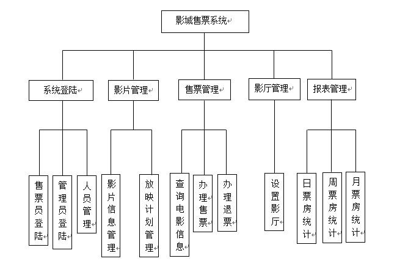

#  MovieManagementSystem

- 本科毕设的作品，写的影城售票管理系统，接下来会一一上传需求、设计和代码。

- 最近用到java写东西，就想着顺道给整理整理。以前总是埋头一路学，很多东西学了忘，忘了学，一直这样会形成恶性循环，不是好的习惯。
学东西的时候，还是得注意整理总结回顾啊。不然很快就会忘了，每次都从头学太费时间了。

- 根据所列出来的需求，票务系统各项基本功能都已经实现了。但是当时写完这个小的票务系统之后，代码也没有重构，很多地方还是很”凌乱“。
再后来，因为改了方向，主要用的语言换成了C++和python，也就没有再继续完善了。不过仍然可以作为一个SSM练手项目，如果您感兴趣的话，也可以继续完善系统。

## Compiler
- Win10
- Myeclipse10 + tomcat 7.0.7 + mysql 5.5.4 或者 Myeclipse2016 + tomcat 8.0 + mysql 5.5.4(软件版本配置可以自行修改）
	
## 选题任务

- 题目《基于Java SSM框架的影城售票系统设计与实现》
- 任务及要求：以Java语言、SSM框架和MySQL数据库，设计一个影城售票系统
- 要求实现以下基本功能：
- 操作员管理（售票、退票）
	- 电影上映信息管理
	- 售票信息录入
	- 统计报表和查询

## 需求分析

- 系统包含两类用户类型，分别是管理员和售票员，而管理员的权限比售票员高。
- 功能性需求分析：
	- 售票员：
		- 查看个人信息、修改密码；
		- 查看并向顾客展示电影信息、影片近期的放映场次、选座；
		- 售票，根据顾客需要购买正在热映的电影票或者预售已经排片的电影票
		- 退票，根据顾客需求，对未过期的电影票进行退票。
	- 管理员：
		- 售票，根据顾客需要购买正在热映的电影票或者预售已经排片的电影票；
		- 退票，根据顾客需求，对未过期的电影票进行退票；
		- 人员管理，对系统当前内存在的售票员进行管理；
		- 影厅管理，设置影厅和影厅座位；
		- 影片管理，录入电影信息；
		- 放映计划管理，对正在上映或即将上映的电影进行排片；
		- 报表管理，生成今日售出的电影票房，本日周月统计报表。
	- 系统功能模块图  
		

## 数据库
- 逻辑结构设计，总共7张表，黑体为主键

	[1]. 员工信息表（**员工编号**，用户名，密码，级别）

	[2]. 影片信息表（**影片编号**，电影名称，主演，导演，影片类型，上映时间，影片时长，剧情简介，宣传图片）

	[3]. 影厅信息表（**影厅编号**，影厅位置，影厅类型，座位数，座位字符串）

	[4]. 放映计划表（**放映计划编号**，影片编号，影厅编号，放映时间）

	[5]. 座位场次表（**放映计划编号**，影厅编号，初始座位字符串，已售出座位字符串）

	[6]. 售票信息表（**电影票编号**，影片编号，影厅编号，座位号，售票时间，放映时间，电影票类型，单价）

	[7]. 日票房统计（**票房统计编号**，统计时间，影片编号，售票数量，总票房）

## 实现效果图

- 登陆界面
	
- 影城售票的主界面图
	

